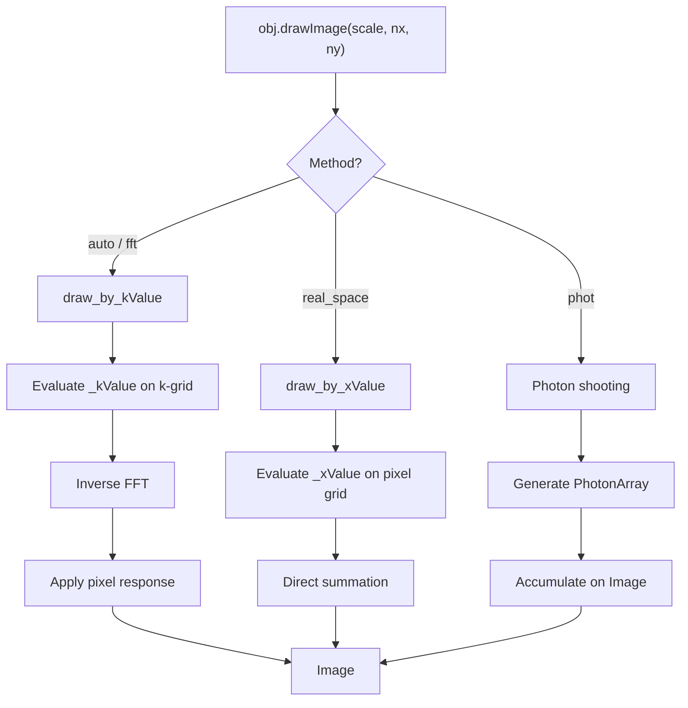

# Drawing Pipeline

`obj.drawImage()` converts a surface brightness profile into a pixel array.

## Overview

## Drawing Methods

### FFT Drawing (`draw_by_kValue`)

The default for most profiles:

1. Determine image size from `_stepk`/`_maxk` (or user-specified `nx`, `ny`)
2. Evaluate `_kValue(kpos)` on a k-space grid
3. Inverse FFT to real space
4. Apply pixel convolution (if not already included)

Efficient for smooth profiles and convolutions (convolution in real space = multiplication in Fourier space).

### Real-Space Drawing (`draw_by_xValue`)

Evaluates `_xValue(pos)` directly at each pixel center, multiplied by pixel area. Simpler but slower for large images. Implemented in `jax_galsim/core/draw.py`.

### Photon Shooting

Generates random photon positions from the profile and accumulates them on an
image grid via `PhotonArray` and `Sensor`.

## Convolution

`Convolve([gal, psf])` creates a lazy `Convolution` object. The actual
convolution happens at draw time:

- **FFT method**: Multiply k-space representations, then inverse FFT
- **Real-space method**: Only supported for simple profile combinations

## `_maxk` and `_stepk`

These properties control automatic image sizing:

- **`_maxk`**: Maximum significant spatial frequency. Determines pixel scale (Nyquist sampling).
- **`_stepk`**: Spacing in k-space. Determines image size (field of view).

For a `Convolution`, `_maxk` = min of components (most compact Fourier representation wins), `_stepk` = min of components (largest real-space extent sets the field of view).
