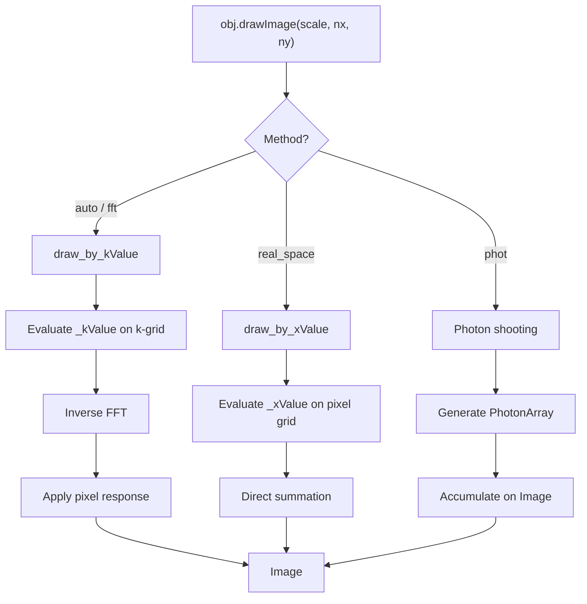

# Drawing Pipeline

When you call `obj.drawImage()`, JAX-GalSim converts a surface brightness profile
into a pixel array. This page describes the rendering pipeline.

## Overview

## Drawing Methods

### FFT Drawing (`draw_by_kValue`)

The default method for most profiles. Steps:

1. Determine image size from `_stepk` and `_maxk` (or user-specified `nx`, `ny`)
2. Build a grid of k-space positions
3. Evaluate `_kValue(kpos)` at each grid point
4. Inverse FFT to get the real-space image
5. Apply pixel convolution (if not already included)

This is efficient for smooth profiles and convolutions, since convolution in
real space is multiplication in Fourier space.

### Real-Space Drawing (`draw_by_xValue`)

Evaluates the profile directly at each pixel center:

1. Build a grid of real-space positions from image bounds and WCS
2. Evaluate `_xValue(pos)` at each grid point
3. Multiply by pixel area

Implemented in `jax_galsim/core/draw.py`. This is simpler but slower for
large images.

### Photon Shooting

Generates random photon positions from the profile and accumulates them on an
image grid. Uses `PhotonArray` and `Sensor` for the photon-to-pixel mapping.

## Convolution

`Convolve([gal, psf])` doesn't immediately compute anything — it creates a lazy
`Convolution` object. The actual convolution happens at draw time:

- **FFT method**: Multiply the k-space representations, then inverse FFT
- **Real-space method**: Only supported for simple profile combinations

## The Role of `_maxk` and `_stepk`

These properties control automatic image sizing:

- **`_maxk`**: The maximum spatial frequency where the profile has significant
  power. Determines the pixel scale (Nyquist sampling).
- **`_stepk`**: The spacing in k-space. Determines the image size (field of view).

For a `Convolution`, `_maxk` is the minimum of the components' `_maxk` values
(the most compact Fourier representation wins), and `_stepk` is the minimum
`_stepk` (the largest real-space extent sets the field of view).
