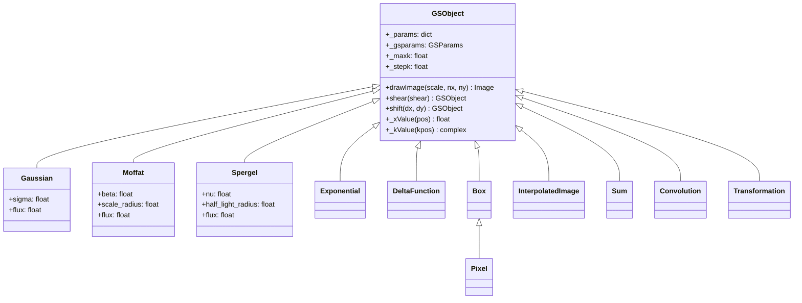

# GSObject Hierarchy

`GSObject` is the base class for all surface brightness profiles in JAX-GalSim.
Every galaxy model, PSF, and optical component inherits from it.

## Class Hierarchy



## The Base Class Contract

Subclasses must implement these methods and properties:

| Member | Type | Purpose |
|--------|------|---------|
| `_xValue(pos)` | Method | Surface brightness at real-space position |
| `_kValue(kpos)` | Method | Fourier-space amplitude at frequency |
| `_maxk` | Property | Maximum k beyond which the profile is negligible |
| `_stepk` | Property | Sampling interval in k-space |

The base class provides the public API built on these primitives:

- `drawImage()` — Renders the profile to a pixel grid (delegates to `core.draw`)
- `shear()`, `shift()`, `rotate()`, `dilate()` — Return transformed copies via `Transformation`
- `__add__` — Returns a `Sum` of profiles
- `withFlux()`, `withGSParams()` — Return copies with modified parameters

## The `_params` Dict

All traced parameters live in a `_params` dictionary. This is the canonical
storage for values that JAX can differentiate through:

```python
gal = jax_galsim.Gaussian(flux=1e5, sigma=2.0)
gal._params  # {"flux": Array(1e5), "sigma": Array(2.0)}
```

Properties like `gal.sigma` and `gal.flux` are thin accessors into `_params`.

## Composition Objects

Profiles can be combined through three composition types:

- **`Sum`** (`Add`): Adds surface brightness profiles together
- **`Convolution`** (`Convolve`): Convolves profiles (e.g., galaxy with PSF)
- **`Transformation`** (`Transform`): Applies affine transformations (shear,
  shift, rotation, flux scaling)

These are themselves GSObjects and can be nested arbitrarily.
