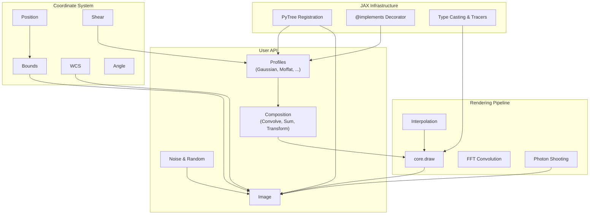

# Architecture Overview

JAX-GalSim mirrors GalSim's architecture while replacing NumPy/C++ internals
with pure JAX. This page provides a high-level map of the major components.

## Component Map



## Module Layout

```
jax_galsim/
├── core/                  # JAX internals
│   ├── draw.py            # Real-space & k-space drawing
│   ├── integrate.py       # Numerical integration
│   ├── interpolate.py     # Spline interpolation
│   ├── math.py            # Gradient-safe math (safe_sqrt, etc.)
│   ├── utils.py           # @implements, has_tracers(), type casting
│   └── wrap_image.py      # Image wrapping utilities
├── gaussian.py            # Gaussian profile
├── moffat.py              # Moffat profile
├── spergel.py             # Spergel profile
├── exponential.py         # Exponential profile
├── box.py                 # Box & Pixel profiles
├── deltafunction.py       # Delta function profile
├── gsobject.py            # Base GSObject class
├── sum.py                 # Sum (Add) composition
├── convolve.py            # Convolution & Deconvolution
├── transform.py           # Affine transformations
├── interpolatedimage.py   # InterpolatedImage
├── image.py               # Image class hierarchy
├── wcs.py                 # WCS base classes
├── fitswcs.py             # FITS WCS implementations
├── fits.py                # FITS I/O
├── noise.py               # Noise models
├── random.py              # Random deviates
├── interpolant.py         # Interpolant functions
├── photon_array.py        # Photon arrays
├── sensor.py              # Sensor model
├── position.py            # Position types
├── bounds.py              # Bounds types
├── angle.py               # Angle & AngleUnit
├── shear.py               # Shear
├── celestial.py           # CelestialCoord
├── gsparams.py            # GSParams configuration
├── errors.py              # Exception classes
├── bessel.py              # Bessel functions
├── integ.py               # Integration (int1d)
└── utilities.py           # General utilities
```

## Design Principles

1. **Drop-in replacement**: Match GalSim's public API so that `import jax_galsim as galsim` works for supported features.

2. **PyTree everywhere**: Every object is a registered JAX PyTree, separating traced parameters (children) from static configuration (auxiliary data).

3. **Docstring inheritance**: The `@implements` decorator copies docstrings from GalSim, appending JAX-specific notes via `lax_description`.

4. **Pure functions**: All operations are pure (no side effects), enabling `jit`, `grad`, and `vmap` compatibility.

## Deep Dives

- [PyTree Registration](pytree.md) — How objects become JAX-compatible
- [The @implements Decorator](implements.md) — Docstring inheritance from GalSim
- [GSObject Hierarchy](gsobject.md) — Base class contract and profile implementations
- [Drawing Pipeline](drawing.md) — How profiles become pixel images
